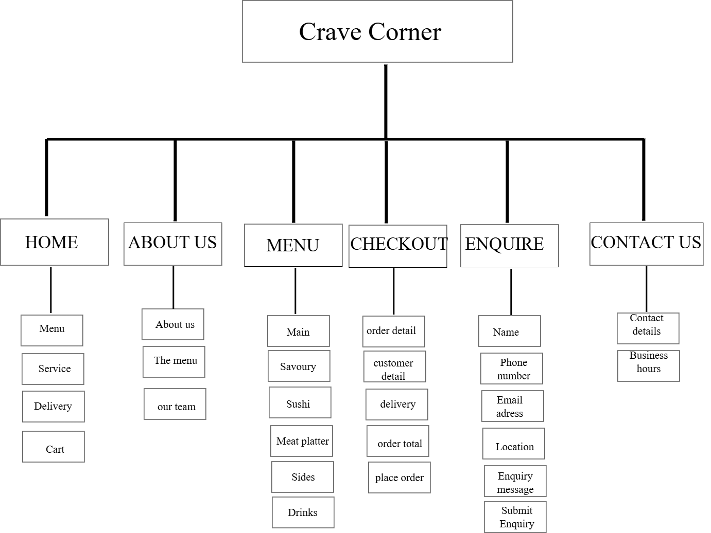

#  Crave Corner

## Where Every Craving Finds Its Flavor!

---

## 1. Student Information

**Student Name:** Busisiwe Ngwenya  
**Student Number:** ST10519363
**Course:** Higher Certificate in Mobile Application and Web Development  
**Module:** WED5020POE  
**Institution:** Rosebank College  

---

## 2. Project Overview

Crave Corner is a food vendor website designed to provide customers with an easy and convenient way to explore the business and its food offerings.

The website allows customers to learn about Crave Corner, view the menu, place orders, make enquiries, and find contact information.

The website uses a modern, simple, and professional design with black and dark brown as the main branding colours.

---

## 3. Business History

Crave Corner was created with the goal of providing fresh, delicious, and affordable food to customers. The business was inspired by a passion for good food and creating enjoyable experiences for customers.

Crave Corner offers a variety of meals, snacks, sides, and drinks while focusing on quality ingredients, affordable prices, and friendly service.

---

## 4. Mission Statement

Our mission is to provide fresh, delicious, and affordable food while delivering friendly and reliable service that satisfies every customer's craving.

---

## 5. Vision Statement

Our vision is to become a trusted and well-loved food business known for quality meals, excellent service, and creating memorable experiences for our customers.

---

## 6. Target Audience

The target audience includes:

- Students and young adults
- Working professionals
- Families
- Local residents
- Food lovers
- Customers looking for affordable and convenient meals

---

## 7. Website Goals and Objectives

The main goals of the website are to:

- Increase Crave Corner's online visibility.
- Provide customers with easy access to the menu.
- Make ordering more convenient.
- Improve communication with customers.
- Provide information about the business.
- Allow customers to submit enquiries.
- Provide clear contact information.
- Promote Crave Corner and its social media platforms.
- Create a simple and user-friendly website.

---

## 8. Key Performance Indicators (KPIs)

| KPI | Target |
|---|---|
| Website Visitors | 500+ per month |
| Online Orders | 50+ per month |
| Customer Enquiries | 20+ per month |
| Menu Views | 300+ per month |
| Conversion Rate | 5–10% |
| Customer Satisfaction | 80%+ positive feedback |
| Social Media Clicks | 100+ per month |
| Website Availability | 99% uptime |

---

## 9. Key Features and Functionality

###  Home Page

- Business logo
- Navigation menu
- Business slogan
- Search bar
- Popular categories
- Featured food
- Delivery information
- Checkout link

###  About Us

- Business history
- Mission statement
- Vision statement
- Information about the menu
- Team information
- Team images

###  Menu

- Food categories
- Food images
- Food descriptions
- Prices
- Available meals
- Order selection

### Checkout

- Selected food items
- Quantity
- Order summary
- Total price
- Customer details
- Delivery or collection information

###  Enquiries

- Customer name
- Phone number
- Email address
- Location
- Enquiry message
- Submit enquiry button

###  Contact Us

- Business location
- Phone number
- Email address
- WhatsApp
- Business hours
- Social media links

---

## 10. Website Design and Branding

The website will have a modern, simple, professional, and food-focused design.

### Colour pallet

**Black** represents:

- Elegance
- Professionalism
- Confidence
- Modernity

**Dark Brown** represents:

- Warmth
- Comfort
- Richness
- Food and natural ingredients

**White** will be used to create contrast and improve readability.

**Charcoal** modernity, simplicity, and professionalism.

### Branding

The website will consistently use:

- Crave Corner logo
- Business name
- Slogan
- Black and dark brown colours
- Consistent typography
- Food-related images

**Slogan:** "Where Every Craving Finds Its Flavor!"

---

## 11. Technologies Used

- HTML5
- Visual Studio Code
- Git
- GitHub

Future development may include:

- CSS
- JavaScript
- Responsive design
- Form validation
- Interactive features

---

## 12. Timeline and Milestones

| Date | Task | 
|-----------------|----------------------------------------------------------------|
| 10-14 Aug|Create a website using HTML, Basic HTML should be used,Navigation bars and no color schemes, Business concept completed |
| 17-31 Aug| CSS styling, Website features identified, Color schemes, Logos, Different type of fonts |
| 4-11 Sept | different screens, Website layout completed, Links, website testing, HTML Development |
| 14-18 Sept | Improvements, Errors corrected , Documentation, README completed, Submission,  Project submitted |

## 13. Sitemap

## 14. Changelog

- pushing and pulling on github
- Created a README.md file.

**Future updates**

Future update will include:

- CSS Styling
- Responsive design
- Java scripting
- Improved Checkout functionality
- Form validation 
- Customer feedback functionality

## 14. Referencing 

1.	Pexels image 1
Pedro Furtado, PF. (2026) Burgerimage. Pexels. Available at: [Photo by pedro furtado from Pexels: https://www.pexels.com/photo/trio-of-gourmet-cheeseburgers-with-toppings-28902883/] (Accessed: 14 August 2026).
2.	Pexels image 2
Amine Kubranur cakiroglu, AKC. (2026) Close-up of a gourmet cheeseburger held by hands in black gloves.Pexels. Available at: [https://www.pexels.com/@amine-kubranur-cakiroglu-689611212/] (Accessed: 14 August 2026).
3.	Pexels image 3
Valerine Boltneva, VB. (2026) Close-up of a gourmet beef burger being held by gloved hands in a restaurant setting. Pexels. Available at: [Photo by Valeria Boltneva from Pexels: https://www.pexels.com/photo/burger-served-in-a-restaurant-18976990/] (Accessed: 14 August 2026).
4.	Pexels image 4
Jaison Jacob Samuel, JBS. (2026) Close-up of a baked pizza with savory toppings in a boxPexels. Available at: [Photo by Jaison Jacob Samuel from Pexels: https://www.pexels.com/photo/delicious-baked-pizza-with-toppings-35609608/] (Accessed: 14 August 2026).
5.	Pexels image 5
Roman odintsov, RO. (2026) A bowl of crispy, delicious french fries garnished with herbs on a dark background.Pexels. Available at: [Photo by ROMAN ODINTSOV from Pexels: https://www.pexels.com/photo/french-fries-in-a-ceramic-bowl-5836999/] (Accessed: 14 August 2026).
6.	Pexels image 6
[Photographer surname], [Initial]. (Year) [Title/description of image]. Pexels. Available at: [Pexels image URL] (Accessed: 14 August 2026).
7.	Pexels image 7
Merkhat Amangeldinov .MA. (2026) A close-up of a cheese pizza with black olives, held by a woman's hand in a cozy restaurant setting.Pexels. Available at: [Photo by Merkhat Amangeldinov from Pexels: https://www.pexels.com/photo/taking-a-slice-of-pizza-20313061/] (Accessed: 14 August 2026).
8.	Pexels image 8
Speak Media Uganda, (2026) . Vibrant mococktails with lime slices served in glasses on a wooden table, perfect for nightlife scenesPexels. Available at: [Photo by Speak Media Uganda from Pexels: https://www.pexels.com/photo/two-drinks-with-lime-and-lemon-on-a-wooden-table-27530811/] (Accessed: 14 August 2026).
9.	Pexels image 9
Kubra Tokur, KT. (2026). Professional chefs work together preparing meals in a restaurant kitchen with steam rising. Pexels. Available at: [Photo by KÜBRA TOKUR from Pexels: https://www.pexels.com/photo/people-working-in-restaurant-kitchen-15441279/] (Accessed: 14 August 2026).
10.	Pexels image 10
Vitaly Gariev, VG. (2026) A professional meeting with a team discussing business strategies in a modern office setting. Pexels. Available at: [Photo by Vitaly Gariev from Pexels: https://www.pexels.com/photo/business-meeting-with-professional-team-in-office-36765719/] (Accessed: 14 August 2026).

11.	Pexels image 10
Alena Darmel, AD. (2026) . Cozy setup with pizza, burgers, and gaming controller, perfect for casual indoor hangouts. Pexels. Available at: [Photo by Alena Darmel from Pexels: https://www.pexels.com/photo/hands-getting-slice-of-pizza-on-a-box-6643712/] (Accessed: 14 August 2026).
